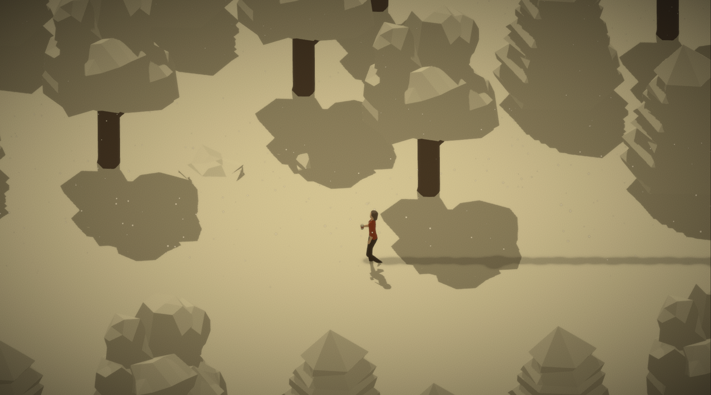
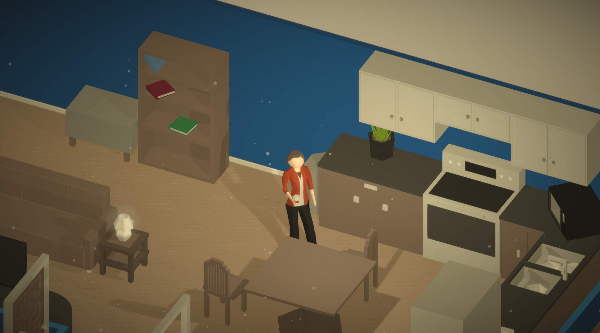

# Untitled Orthographic Game

- [Overview](#overview)
- [Media](#media)
- [Attributions](#attributions)
- [License](#license)

## Overview
Untitled Orthographic Game (That's a placeholder name) is currently a work in-progress narrative adventure game that puts heavey emphasis on player choice and freedom.

*Note: For the time being, progress on this project has been discontinued due to time constraints. Progress may continue in the future.*

## Media

  

## Attributions
[Attributions](NOTICE.md)

## License
This work is licensed under a [Creative Commons Attribution-NonCommercial 4.0 International License][cc-by-nc].

[![CC BY-NC 4.0][cc-by-nc-image]][cc-by-nc]

[cc-by-nc]: http://creativecommons.org/licenses/by-nc/4.0/
[cc-by-nc-image]: https://licensebuttons.net/l/by-nc/4.0/88x31.png
[cc-by-nc-shield]: https://img.shields.io/badge/License-CC%20BY--NC%204.0-lightgrey.svg

The underlying source code is licensed under [GNU General Public License v3.0](LICENSE.md).

